[中文](README.md) [English](README_EN.md) [日本語](README_JP.md)


<h1 align="center">SuperConnectX</h1>

[](#)
[](https://github.com/SuperStudio/SuperConnectX)
[](https://github.com/SuperStudio/SuperConnectX/fork)


SuperConnectX 是**超级终端工具**，支持 com、telnet 等终端连接，完全**使用 vibe coding 开发**

下载地址：[个人版 Releases](https://github.com/naiheSH/SuperConnectX/releases)；上游项目：[SuperStudio/SuperConnectX](https://github.com/SuperStudio/SuperConnectX)

## macOS 安装与更新

- Apple Silicon（M1/M2/M3/M4 等）请选择文件名包含 `macos-arm64.dmg` 的安装包；Intel Mac 请选择 `macos-x64.dmg`。
- 项目当前未使用 Apple Developer ID 签名和公证。首次从浏览器下载并安装后，macOS 可能提示“无法验证开发者”或“应用已损坏”。请先在“系统设置 → 隐私与安全性”中找到被拦截记录，然后点击“仍要打开”。
- 如果系统设置中没有“仍要打开”，仅在确认应用来自本项目 Releases 且已核对 `SHA256SUMS` 后，打开“终端”执行：

```bash
xattr -r -d com.apple.quarantine "/Applications/superconnectx.app"
```

- 如果安装到了其他目录，请将命令中的路径替换为实际 `.app` 路径。命令必须指向具体应用，避免对 `/Applications` 整体移除隔离属性。
- 应用内可以检查 GitHub Release 元数据并识别对应 CPU 架构的更新包，但 macOS 自动安装更新依赖有效的代码签名，未签名版本不保证能够自动完成安装。建议点击更新窗口中的“官网下载”，前往 Releases 手动下载并覆盖安装；安装后若再次被 Gatekeeper 拦截，可重复以上步骤。


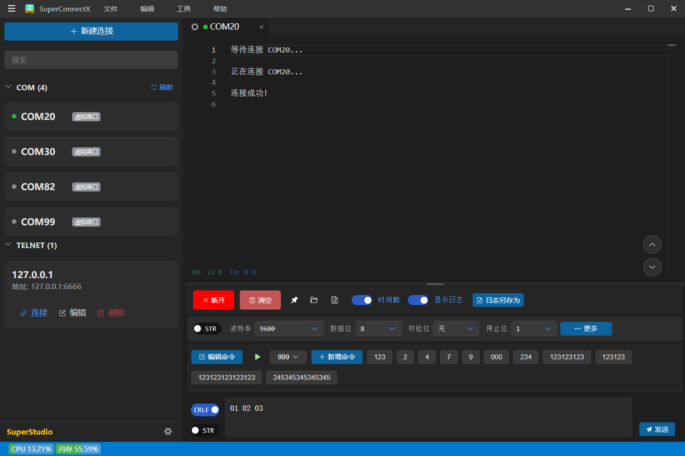


# 功能创新

1、串口等功能完全继承自 [SuperCom](https://github.com/SuperStudio/SuperCom)

2、支持 telnet 功能

# 软件特性

## 语法高亮

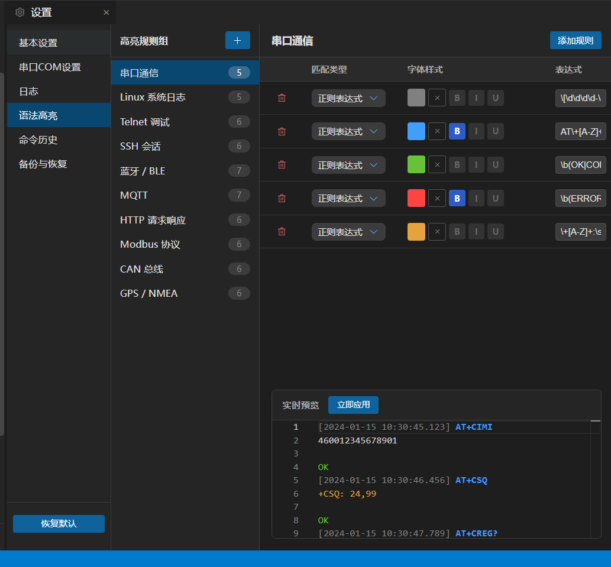

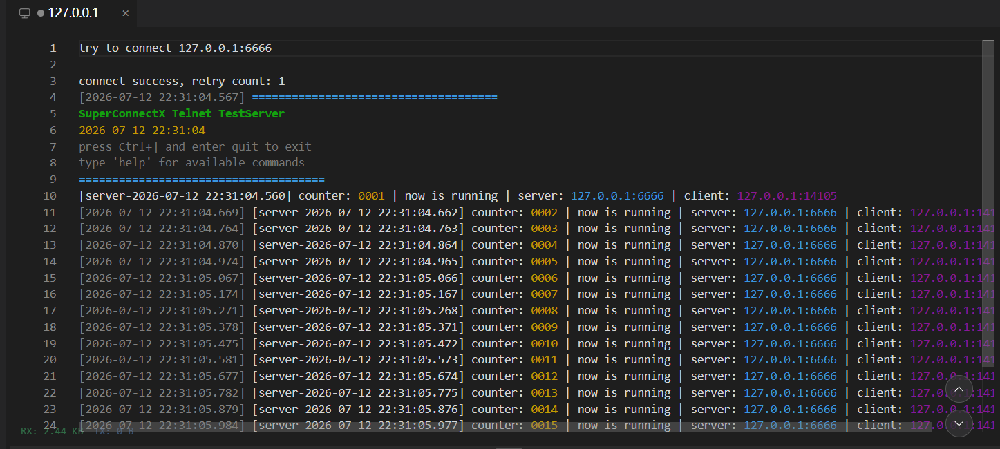

## 分屏

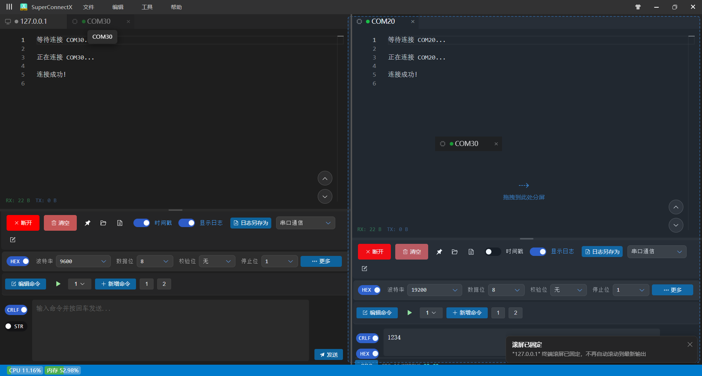

支持选项卡拖拽

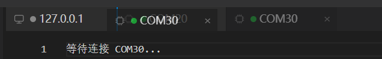

## 命令编辑

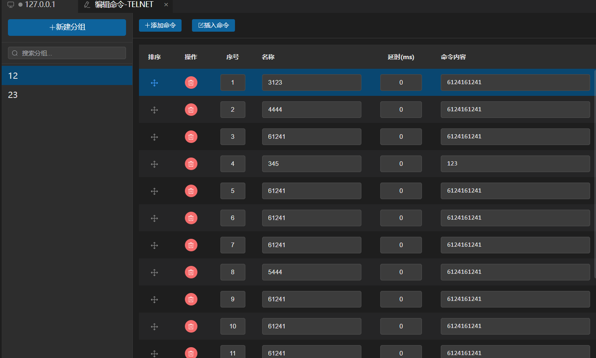

命令循环批量运行

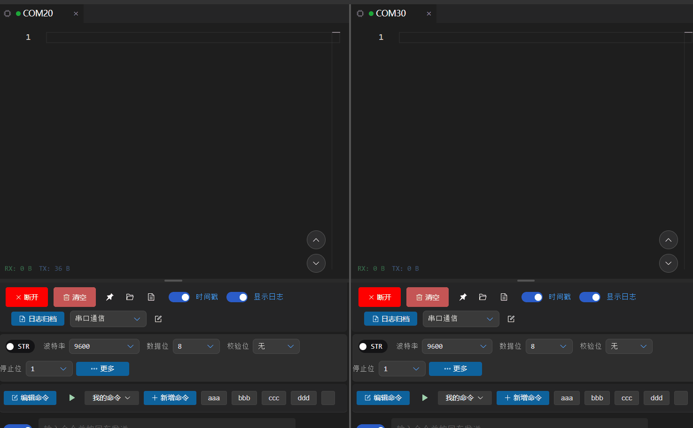


## 串口CRC校验

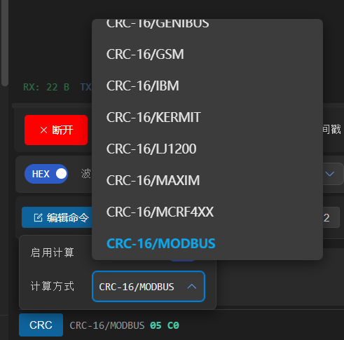

## 主题-深浅模式

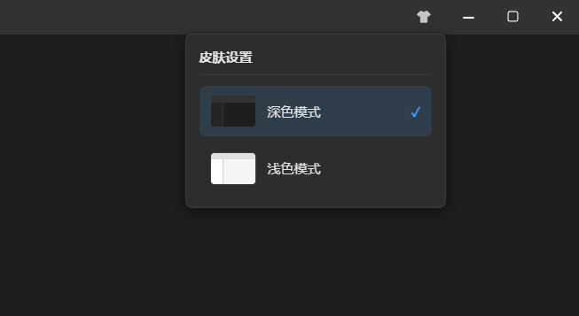

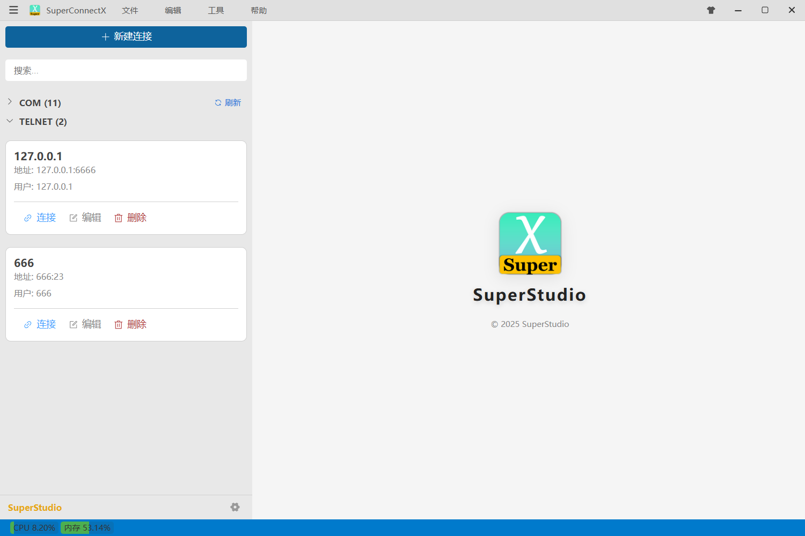

## 支持多种连接

com/telnet/ftp

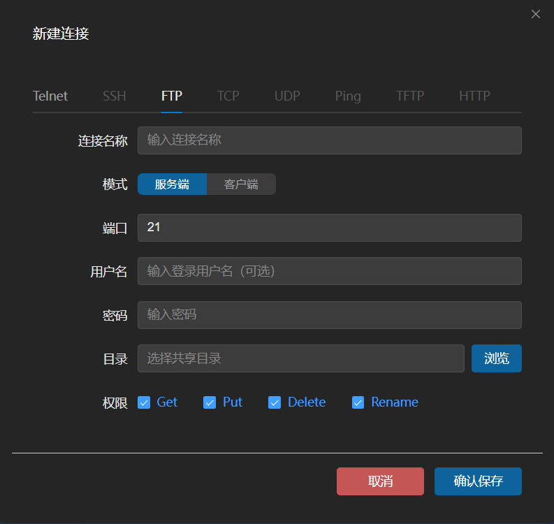

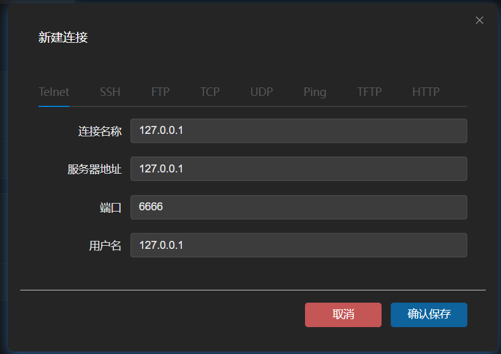

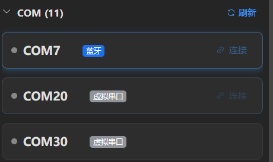

## 支持虚拟串口模拟

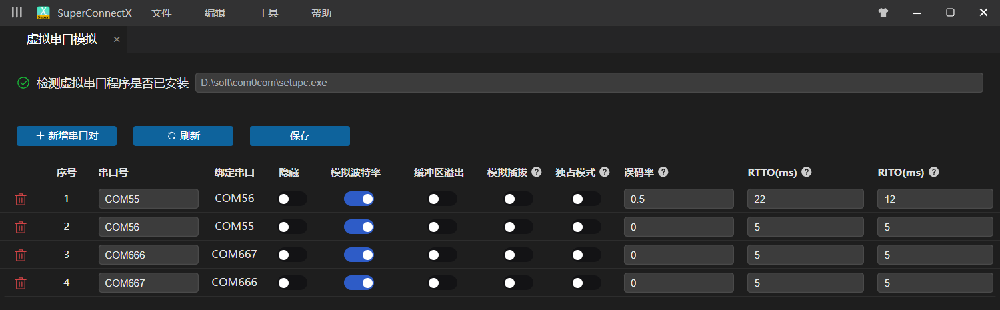

## 快捷键

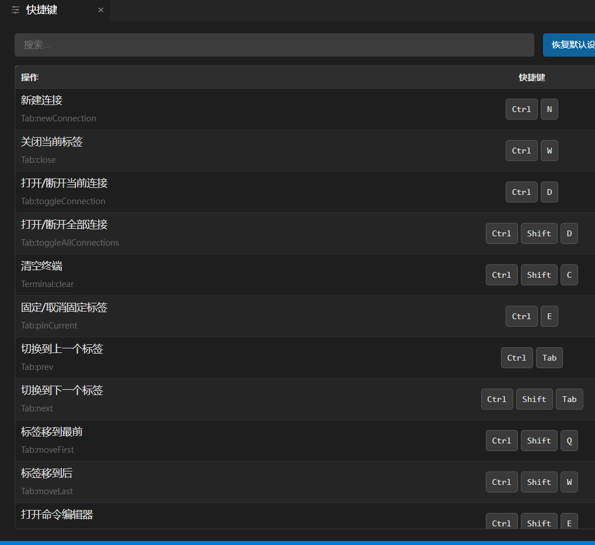

## 导入导出数据

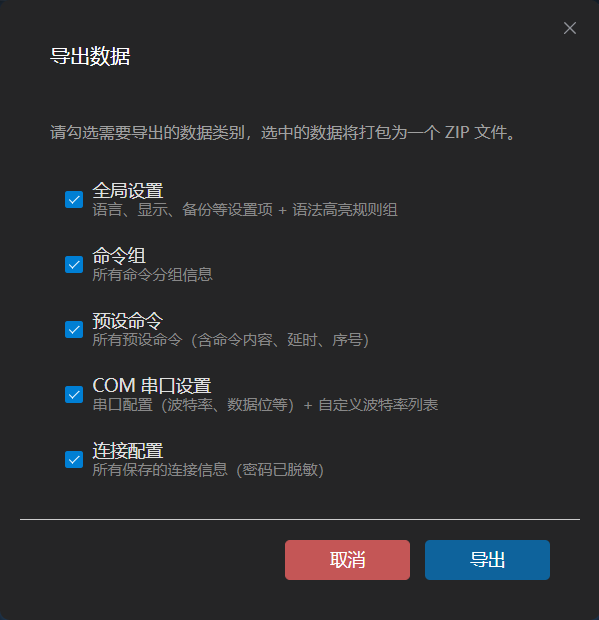

## 字体、换行等

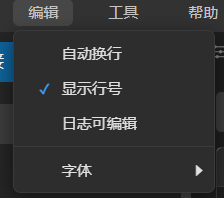


## 自动更新

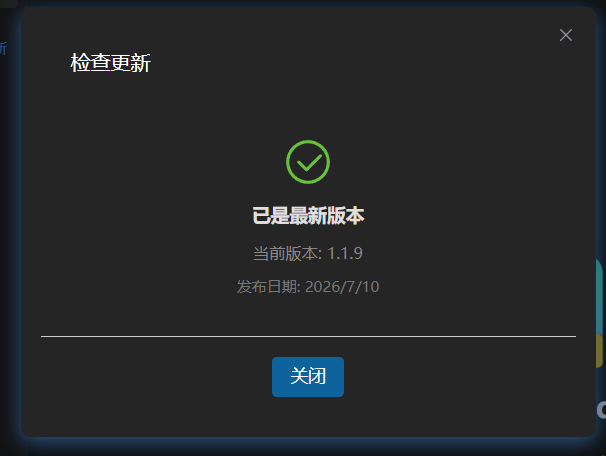

# 如何开发？

## 环境配置

安装依赖

```bash
npm install
```

运行

```bash
npm run dev
```

## 参与开发

vscode 中下载插件 codebuddy，或者使用其他 agent 进行 vibe coding 即可

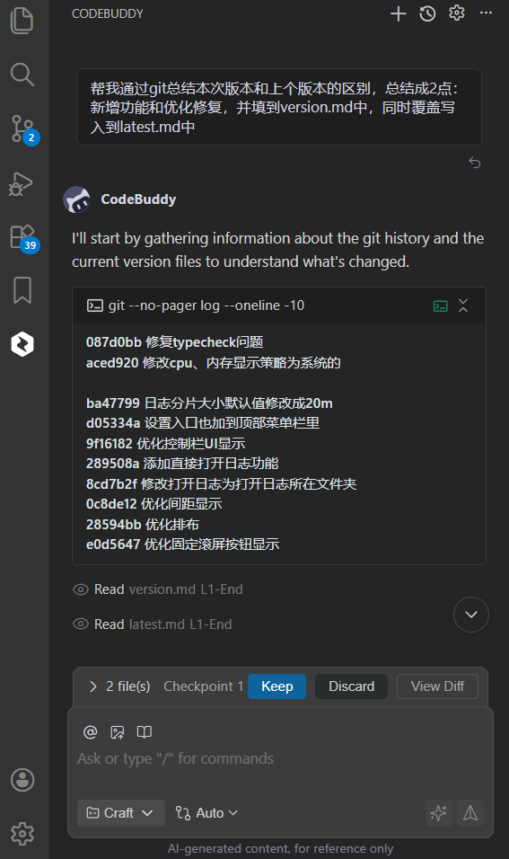

# 版本发布

## 自动生成 releaseNotes

将 skills\version-generate.md 中的文本粘贴到 vibe coding 对话框里即可

## codecheck检查

运行 `npm run typecheck`

## 本地构建

运行 `build.bat` 即可

## 流水线构建

运行 `release.bat` 即可，github actions会自动启动，构建完成后自动生成最新 releases

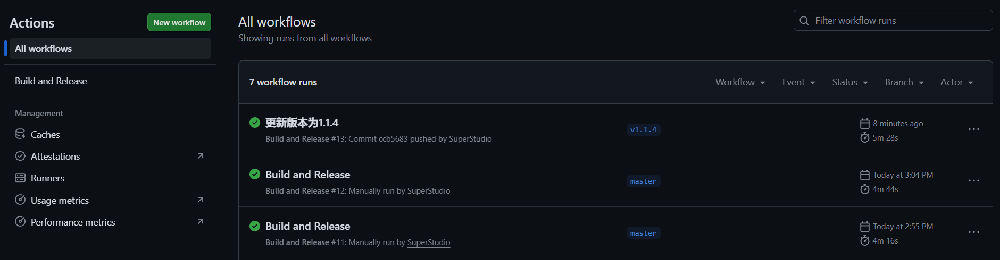
