[中文](README.md) [English](README_EN.md) [日本語](README_JP.md)


<h1 align="center">SuperConnectX</h1>

[](#)
[](https://github.com/SuperStudio/SuperConnectX)
[](https://github.com/SuperStudio/SuperConnectX/fork)


SuperConnectXは、COMやTelnetなどの端末接続をサポートする**スーパー端末ツール**で、完全に**Vibe Coding**で開発されています。

ダウンロード：[こちらからダウンロード](https://github.com/SuperStudio/SuperConnectX/releases)


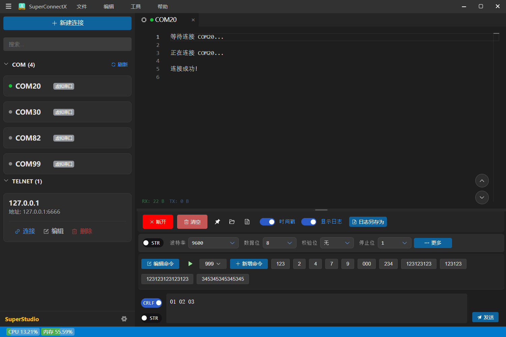


# 機能の革新

1. シリアルポート機能は [SuperCom](https://github.com/SuperStudio/SuperCom) から完全に継承

2. Telnet機能に対応

# ソフトウェアの特徴

## シンタックスハイライト

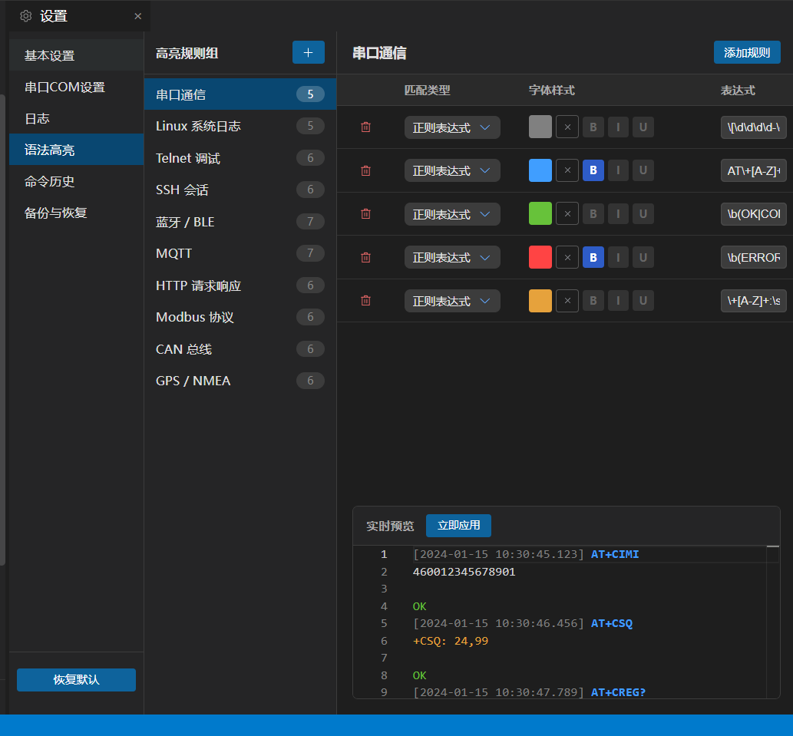

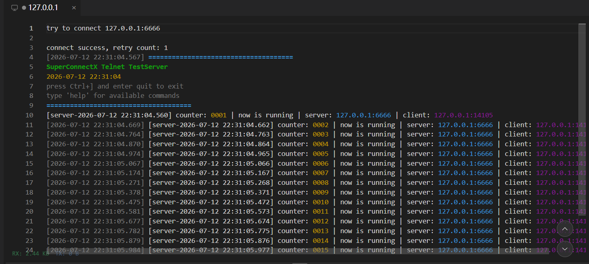

## 画面分割

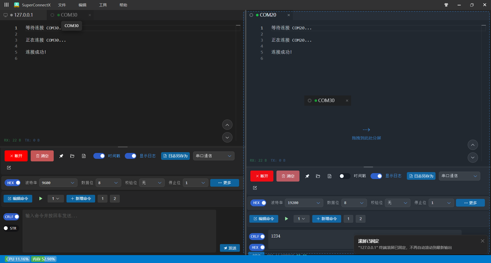

タブのドラッグ＆ドロップに対応

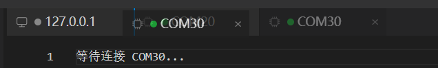

## コマンドエディタ

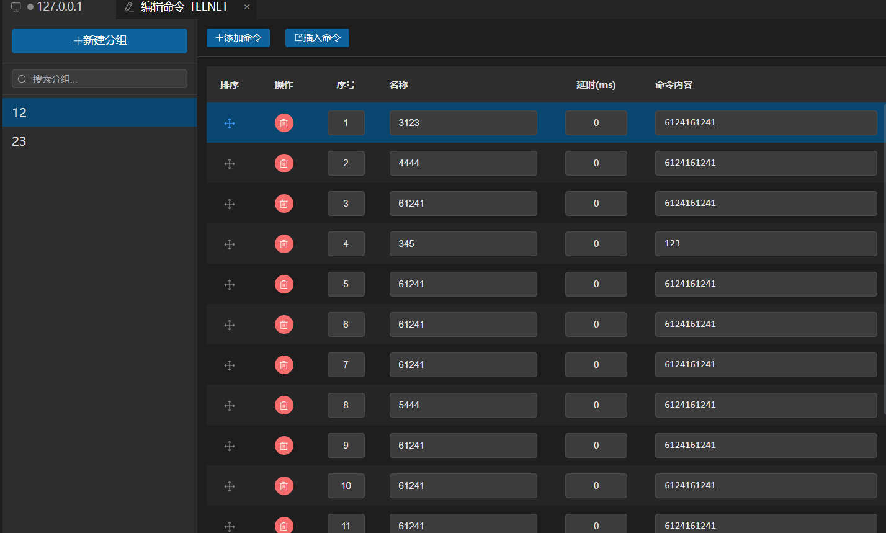

## シリアルCRCチェック

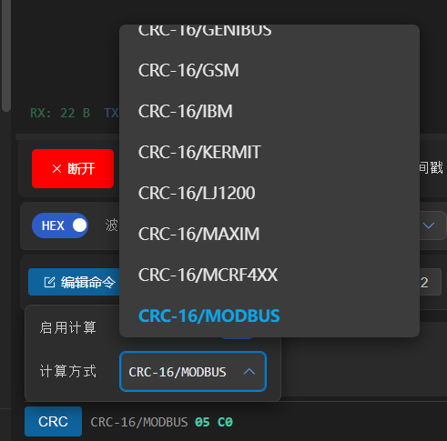

## テーマ - ダーク / ライトモード

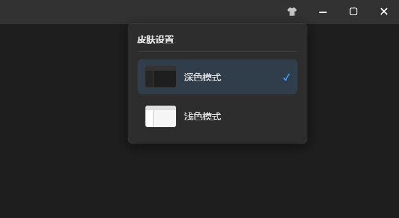

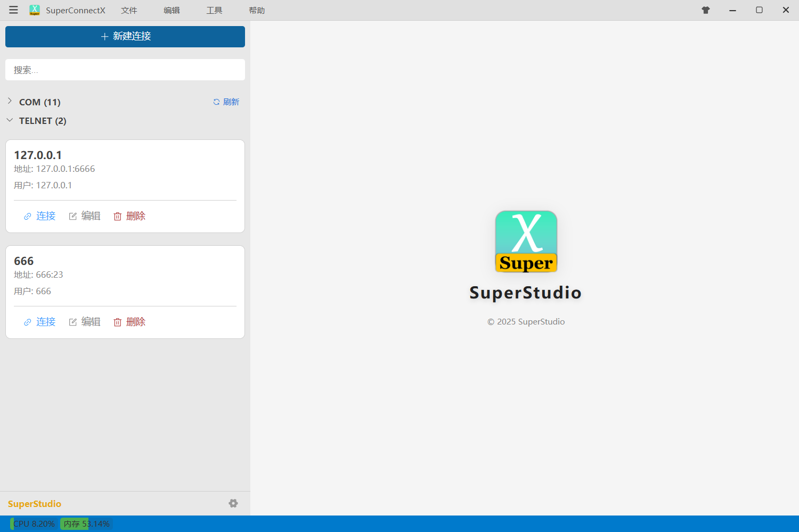

## 複数接続のサポート

COM / Telnet / FTP

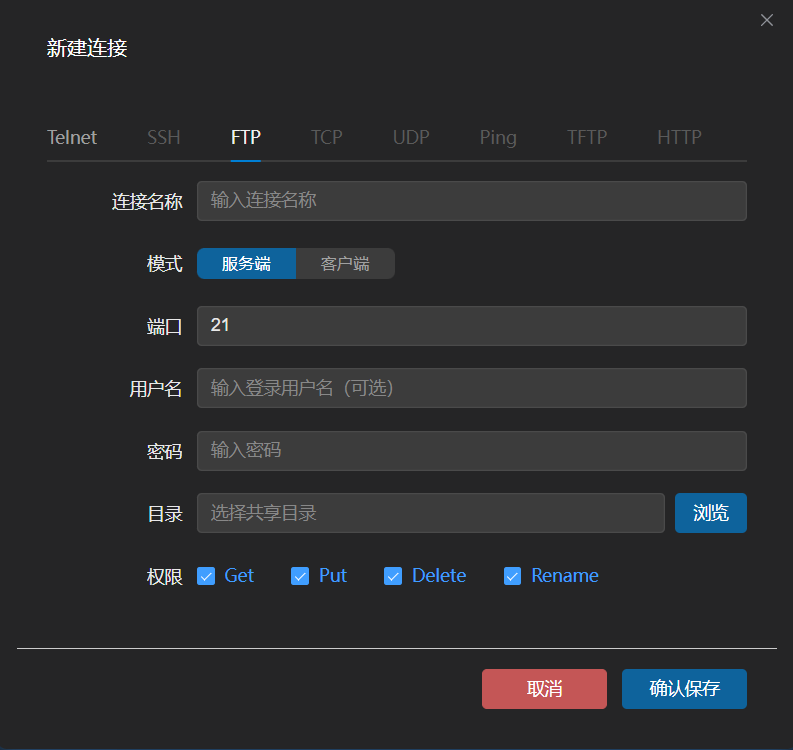

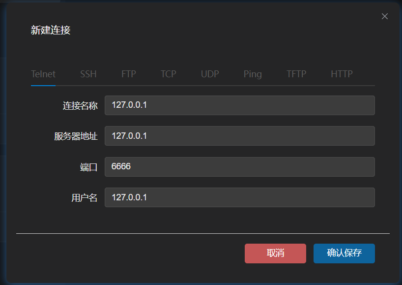

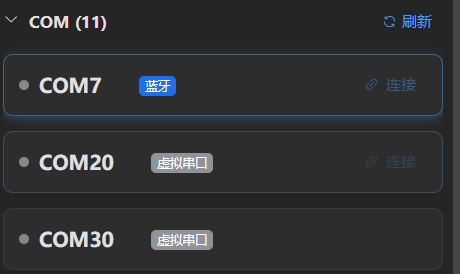

## ショートカットキー

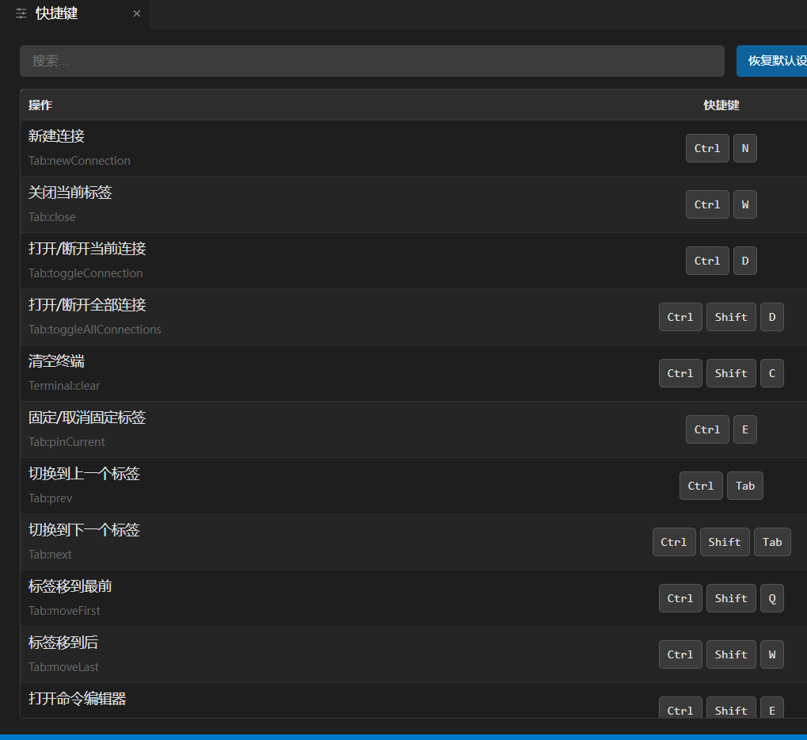

## データのインポート / エクスポート

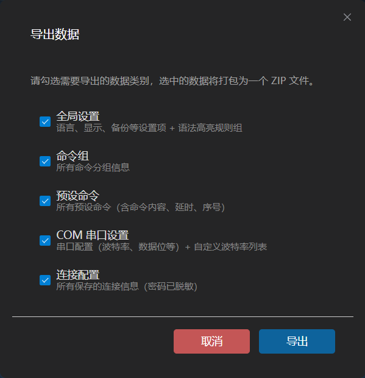

## フォント、折り返しなど

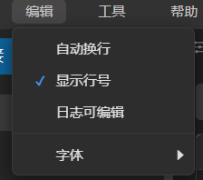


## 自動更新

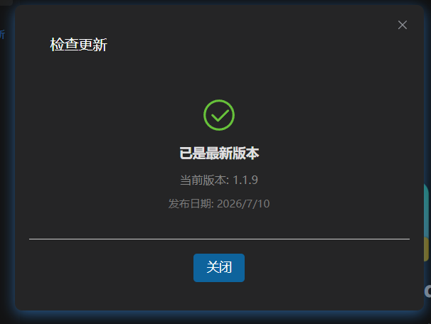

# 開発方法

## 環境設定

依存関係のインストール

```bash
npm install
```

実行

```bash
npm run dev
```

## 開発への参加

VS CodeでCodeBuddy拡張機能をインストールするか、他のエージェントを使用してVibe Codingを行ってください。

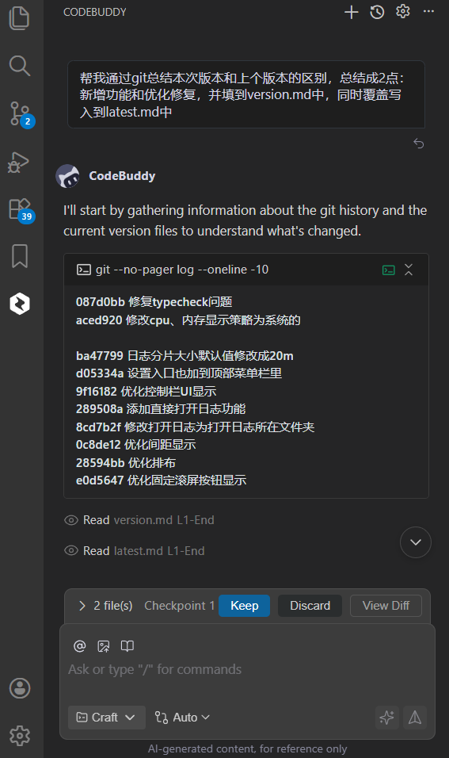

# バージョンリリース

## リリースノートの自動生成

`skills/version-generate.md` の内容をVibe Codingのダイアログに貼り付けてください。

## コードチェック

`npm run typecheck` を実行してください。

## ローカルビルド

`build.bat` を実行してください。

## CI/CD ビルド

`release.bat` を実行すると、GitHub Actionsが自動的に起動し、ビルド完了後に最新のリリースが自動生成されます。

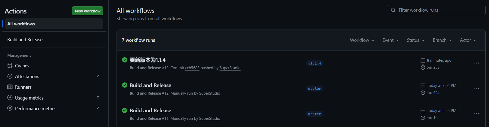
