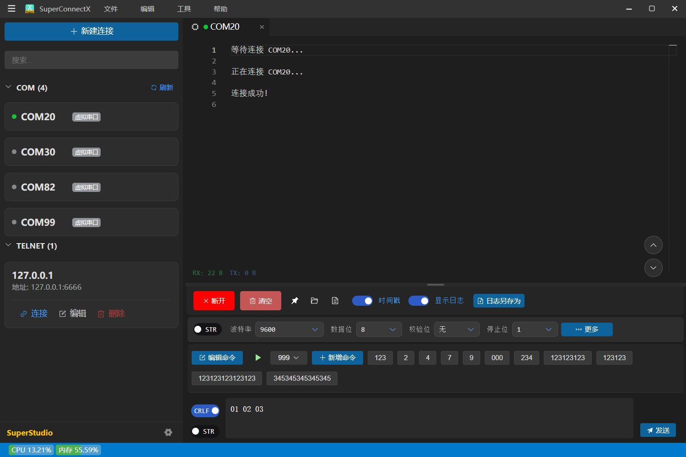
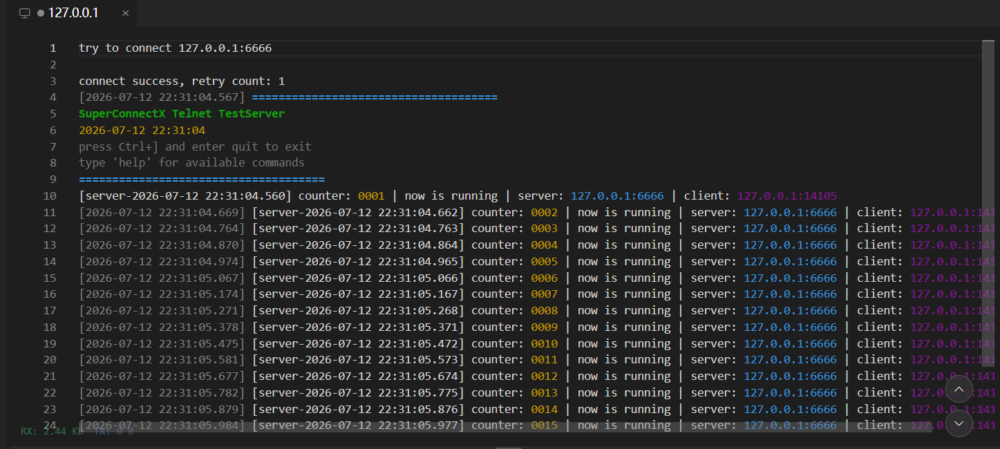
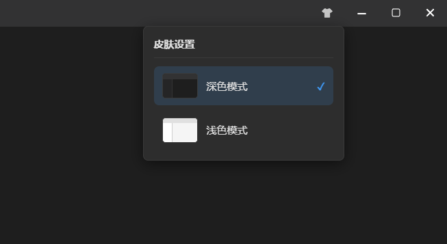
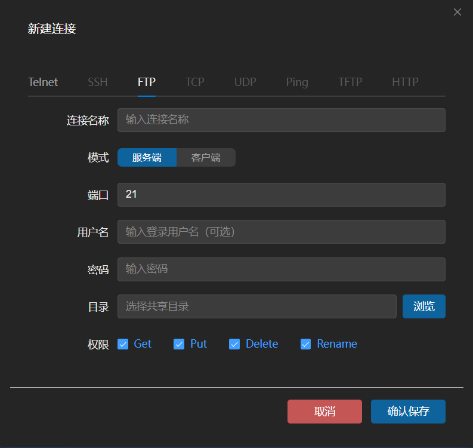
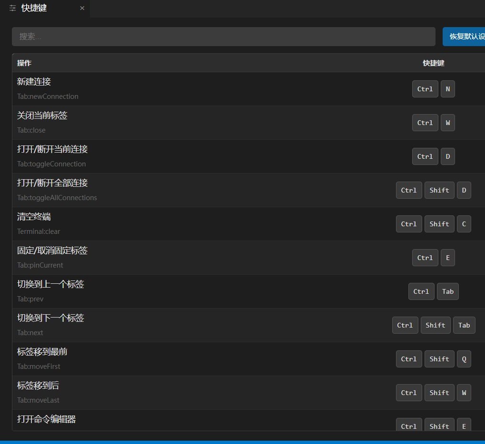
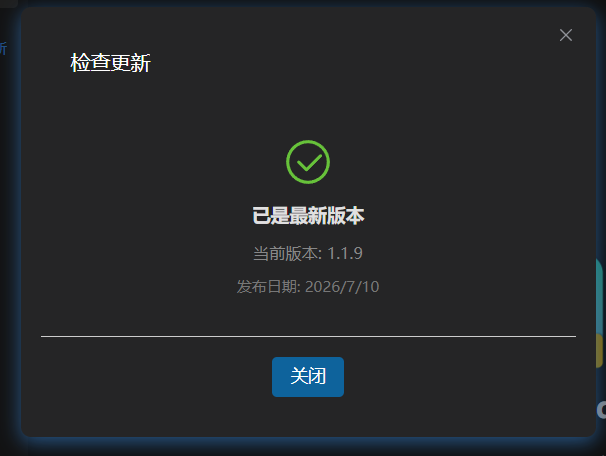
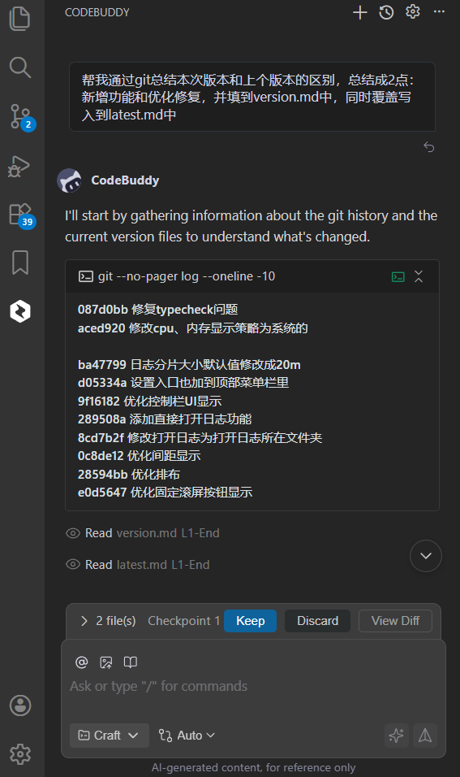
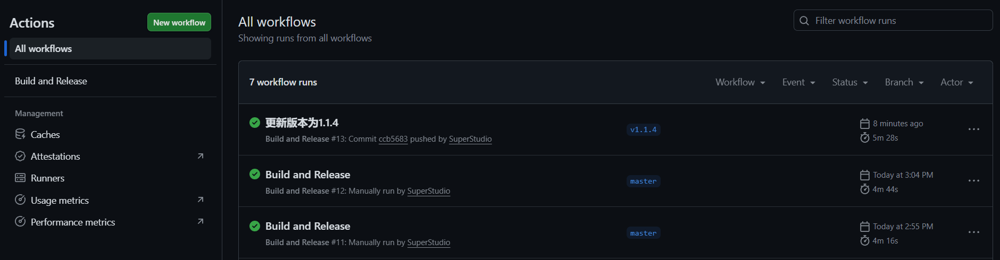

[中文](README.md) [English](README_EN.md) [日本語](README_JP.md)


<h1 align="center">SuperConnectX</h1>

[](#)
[](https://github.com/SuperStudio/SuperConnectX)
[](https://github.com/SuperStudio/SuperConnectX/fork)


SuperConnectXは、COMやTelnetなどの端末接続をサポートする**スーパー端末ツール**で、完全に**Vibe Coding**で開発されています。

ダウンロード：[個人版 Releases](https://github.com/naiheSH/SuperConnectX/releases)。上流：[SuperStudio/SuperConnectX](https://github.com/SuperStudio/SuperConnectX)





# 機能の革新

1. シリアルポート機能は [SuperCom](https://github.com/SuperStudio/SuperCom) から完全に継承

2. Telnet機能に対応

# ソフトウェアの特徴

## シンタックスハイライト




## 画面分割


タブのドラッグ＆ドロップに対応


## コマンドエディタ


コマンドのループ一括実行


## シリアルCRCチェック


## テーマ - ダーク / ライトモード




## 複数接続のサポート

COM / Telnet / FTP




## 仮想シリアルポートエミュレーション


## ショートカットキー



## データのインポート / エクスポート


## フォント、折り返しなど


## 自動更新



# 開発方法

## 環境設定

依存関係のインストール

```bash
npm install
```

実行

```bash
npm run dev
```

## 開発への参加

VS CodeでCodeBuddy拡張機能をインストールするか、他のエージェントを使用してVibe Codingを行ってください。



# バージョンリリース

## リリースノートの自動生成

`skills/version-generate.md` の内容をVibe Codingのダイアログに貼り付けてください。

## コードチェック

`npm run typecheck` を実行してください。

## ローカルビルド

`build.bat` を実行してください。

## CI/CD ビルド

`release.bat` を実行すると、GitHub Actionsが自動的に起動し、ビルド完了後に最新のリリースが自動生成されます。



# 個人版とログ管理

この個人版は上流の [SuperStudio/SuperConnectX](https://github.com/SuperStudio/SuperConnectX) を基にし、配布物と更新元は [naiheSH/SuperConnectX](https://github.com/naiheSH/SuperConnectX) です。シリアル名表示、ログ管理、パッケージング、リリース処理を追加で保守しています。

## ログ管理ガイド

- 設定でログ分割をオン/オフできます。オンの場合は分割サイズ（既定 20 MB）で分割され、オフまたは「無制限」ではサイズ制限がありません。
- ツールバーの操作は現在「名前を付けて保存」のみで、`saveLogFileAs` を呼び出します。現在のファイルはローテーションしません。`rotateLogFile` は内部機能で UI の入口はありません。
- 通常は分割ファイルの境界を含めて保存します。時間範囲を指定した場合は範囲内の行だけとなり、完全な分割ファイルや再起動をまたぐ完全なエクスポートは保証されません。
- クリーンアップは最大保持日数と最大ファイル数に従い、0 は削除なしまたは無制限を意味します。
- シリアルの備考はログ名と保存名に使われます。Linux/macOS の `/dev/...` は安全なファイル名として表示され、Windows の `COMx` は読みやすいままです。
- 通知の既定表示時間は 5 秒です。本番版は起動後に更新を確認しますが、開発環境では自動確認しません。更新元は個人 fork です。

## 機能
- 中国語シリアルポートエンコーディングと Linux パッケージングに対応
- 受信データに行ごとのタイムスタンプを表示
- 現在のエクスポート設定に従ったログの保存（名前を付けて保存）
- AI コンテキストドキュメントを追加（中国語ローカライズ）
- Windows zip リリースアーティファクトを追加
- Ubuntu 24 対応ビルドを追加（Electron 35 + 38）
- macOS デュアルアーキテクチャビルドを追加（arm64 + x64）
- naihe タグリリースに対応
- リリースワークフローで変更ログを自動生成
- afterPack フックで chrome-sandbox 権限を自動修正
- バージョンサフィックス -naihe、通知は既定で 5 秒間表示

## 修正
- リリースワークフローの npm キャッシュ設定を修正
- Linux リリース設定を修正
- Linux ログの「名前を付けて保存」デフォルトファイル名を修正
- トレイアイコンリソースを修正
- ログ分割ファイル名のベース名を修正
- ログの「名前を付けて保存」デフォルトファイル名を調整
- リリースアーティファクトをインストーラ形式に変更
- カスタムタグリリースの命名を修正
- Ubuntu 24 ビルドアーティファクトのファイル名競合を修正
- AppDir テストのクロスプラットフォーム互換性を修正
- TypeScript 型エラーを修正
- Linux シリアルポートフィルタリングを再適用（上游マージ後に喪失）
- CI テスト失敗を修正
- macOS ビルドの Python setuptools インストールを修正
- macOS pip externally-managed-environment を修正
- macOS と他のプラットフォームの Python setuptools を区別
- ログローテーションのデータ損失とタイムスタンプ正規表現を修正
- シリアルポートフィルタリングを保守的に変更

## CI
- クロスプラットフォームビルドワークフローを追加
- macOS Intel ビルドランナーを修正
- macOS アーキテクチャ別パッケージを個別公開
- リリースアーティファクトとシリアルポートフィルタリングを更新

## テスト
- プラットフォーム別シリアルポートテストフィクスチャを使用
- Windows シリアルポートテストの期待値を修正
